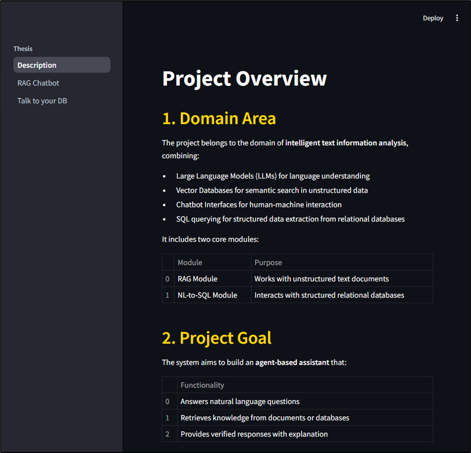
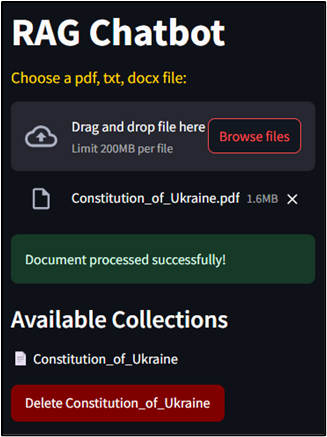
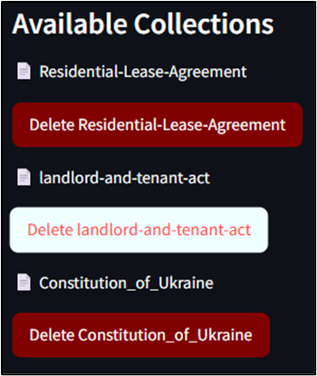
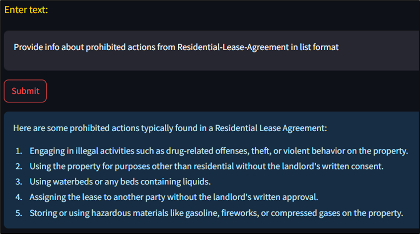
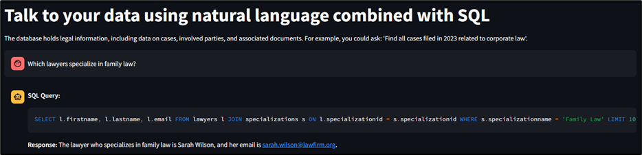
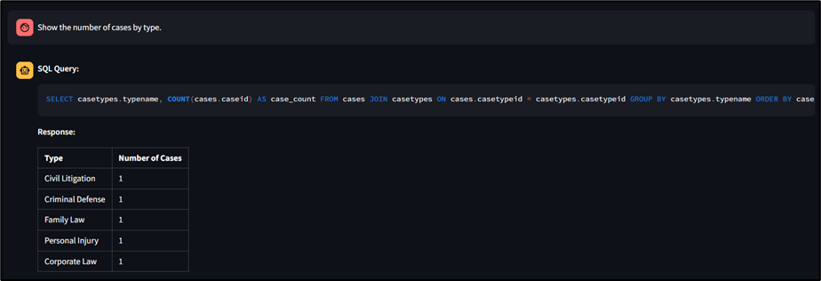

# 📚 Thesis
Cистема аналізу юридичних документів

---

## 👤 Автор
**ПІБ:** Батенчук Наталія Михайлівна  
**Група:** ФеІ-44   
**Керівник:** Бойко Ярослав Васильович, кандидат фізико-математичних наук, доцент кафедри радіоелектронних і комп’ютерних систем  
**Дата виконання:** 08.05.2025

---

## 📌 Загальна інформація
**Тип проєкту:** Веб-застосунок  
**Мова програмування:** Python  
**Фреймворки / Бібліотеки:** Streamlit, LangChain, ChromaDB, PostgreSQL, Azure OpenAI  

---

## 🧠 Опис функціоналу
🤖 **RAG Chatbot** - семантичний пошук і відповіді на основі завантажених документів  
📄 **Обробка документів** - підтримка PDF, TXT, DOCX файлів  
🗃️ **Векторна база даних** - ChromaDB для зберігання embeddings  
🗣️ **Багатомовність** - автоматичне визначення мови запиту  
💾 **SQL чат-бот** - природномовні запити до PostgreSQL бази даних  
📊 **Автоматична база даних** - створення та наповнення Chinook DB  
🔐 **Безпека БД** - read-only користувач для SQL агента  
⚡ **Інтерфейс** - багатосторінковий Streamlit додаток  

---

## 🧱 Опис основних класів / файлів

| Файл / Клас | Призначення |
|-------------|-------------|
| `main.py` | Точка входу, навігація між сторінками Streamlit |
| `Tasks.py` | Опис проєкту |
| `rag_chatbot.py` | Головна логіка RAG чат-бота з LangChain агентом |
| `simple_rag.py` | Обробка документів, ChromaDB операції, пошуковий інструмент |
| `chat_postgres.py` | SQL чат-бот з LangGraph для природномовних запитів до БД |
| `postgres.py` | Утиліти для створення БД, користувачів та керування PostgreSQL |
| `sql_commands.py` | SQL команди для створення та наповнення Chinook DB |

---

## ▶️ Як запустити проєкт "з нуля"

### 1. Встановлення інструментів
- Python 3.8+
- PostgreSQL 12+
- Azure OpenAI API ключ

### 2. Клонування репозиторію
```bash
git clone [your-repository-url]
cd thesis
```

### 3. Встановлення залежностей
```bash
pip install -r requirements.txt
```

### 4. Створення .env файлу
```env
# Azure OpenAI
AZURE_OPENAI_API_KEY=your_azure_openai_key
AZURE_OPENAI_ENDPOINT=https://your-resource.openai.azure.com/
OPENAI_API_VERSION=2023-05-15

# PostgreSQL
READ_PASS=your_read_password
```

### 5. Налаштування PostgreSQL
Переконайтеся, що PostgreSQL запущений і доступний. Змініть параметри підключення у файлах:
- `chat_postgres.py` (рядки 23-31)

### 6. Запуск
```bash
streamlit run main.py
```

---

## 🗂️ Структура проєкту
```
├── main.py            
├── __init__.py
├── rag_chatbot.py        
├── core/
│   ├── simple_rag.py    
│   ├── postgres.py       
│   └── sql_commands.py  
├── pages/
│   └── Tasks.py          
│   └── chat_postgres.py  
├── chroma_db/            
└── requirements.txt      
```

---

## 🔌 API та функціонал

### 📚 RAG Chatbot
- **Завантаження документів:** PDF, TXT, DOCX
- **Автоматичне чанкування:** RecursiveCharacterTextSplitter
- **Embeddings:** Azure OpenAI text-embedding-ada-002
- **Пошук:** Семантичний пошук по всіх колекціях
- **Мультимовність:** Автоматичне визначення мови запиту

### 🗄️ SQL Chatbot
- **Природномовні запити:** Перетворення запитів на SQL
- **Безпека:** Read-only доступ до БД
- **Підтримувана БД:** Chinook (справи, клієнти, суди, юристи)
- **Візуалізація:** Markdown таблиці для результатів

---

## 🖱 Інструкція для користувача

### RAG Chatbot сторінка:
1. **Завантаження документів:**
   - Перетягніть PDF, TXT або DOCX файл
   - Файл автоматично обробиться та індексується
   
2. **Спілкування:**
   - Введіть запитання про завантажені документи
   - Система знайде релевантну інформацію та відповість
   - Підтримує 55 мов звернень

3. **Керування колекціями:**
   - Перегляд доступних колекцій у лівій панелі
   - Видалення непотрібних колекцій

### SQL Chatbot сторінка:
1. **Природномовні запити:**
   - "Which lawyers specialize in family law?"
   - "Show the number of cases by type."
   - "Which court has handled the most cases?"

2. **Результати:**
   - SQL запит показується для прозорості
   - Результати форматуються як таблиці або текст


---

## 🧪 Проблеми і рішення

| Проблема | Рішення |
|----------|---------|
| Помилка підключення до PostgreSQL | Перевірити параметри підключення у `postgres.py` |
| Azure OpenAI API помилки | Перевірити ключі та endpoint у `.env` файлі |
| ChromaDB не зберігає дані | Переконатись що папка `chroma_db/` має права запису |
| SQL запити не виконуються | Перевірити, що база даних створена та read-only користувач існує |
| Документи не обробляються | Перевірити підтримувані формати (PDF, TXT, DOCX) |

---


---

## 🧾 Використані джерела / література
- [LangChain Documentation](https://python.langchain.com/)
- [Streamlit Documentation](https://docs.streamlit.io/)
- [ChromaDB Documentation](https://docs.trychroma.com/)
- [Azure OpenAI Service](https://azure.microsoft.com/en-us/products/ai-services/openai-service)
- [PostgreSQL Documentation](https://www.postgresql.org/docs/)

---

## 📷 Screenshots
- Головна сторінка навігації



- RAG Chatbot






- SQL Chatbot з прикладами запитів





---

## 🚀 Можливості розширення
- Інтеграція з іншими типами баз даних
- Підтримка більше форматів документів
- Покращення UI/UX дизайну
- Додавання аутентифікації користувачів
- API endpoint для зовнішніх додатків
